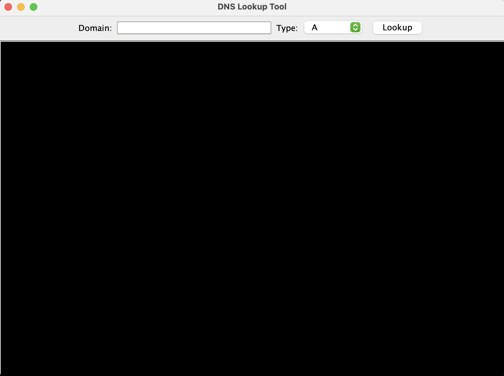
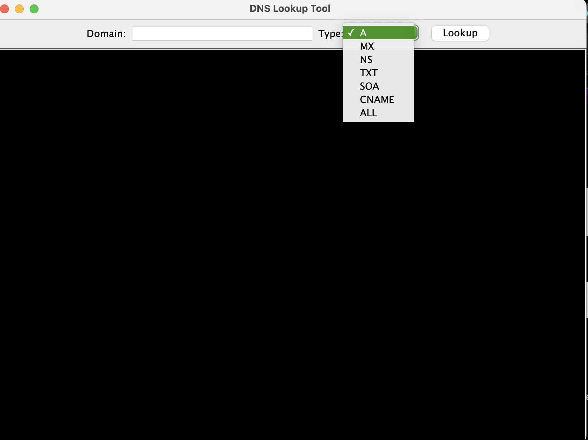
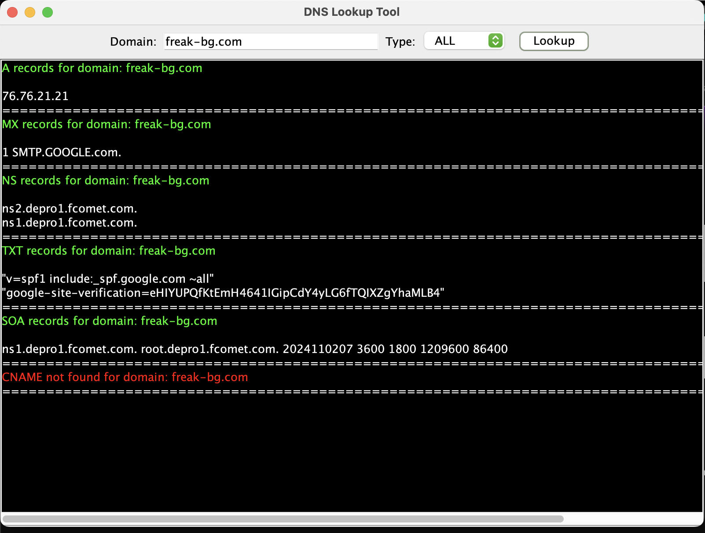

# Desktop application, real-time DNS record checker.

In other words that's the desktop version of my already existing DNS checker browser extension which you can review below:

 [this detailed report](https://github.com/Sensabg/DNS-Qchecker/).

Of course, there are a lot of differences, starting with the programming language. 
In fact, the only thing they have in common is their name (Qchecker) and purpose but they achieve the same goal in different ways.

# Structure 

```sh
DNS
├── src/  
│ㅤㅤㅤ└── main/        
│ㅤㅤㅤㅤㅤㅤㅤㅤ└── java/
│ㅤㅤㅤㅤㅤㅤㅤㅤ├── DNS.java       
│ㅤㅤㅤㅤㅤㅤㅤㅤ├── DNSGUI.java    
│ㅤㅤㅤㅤㅤㅤㅤㅤ├── Main.java
│ㅤㅤㅤㅤㅤㅤㅤㅤ├── TextAreaOutputStream.java
│ㅤㅤㅤㅤㅤㅤㅤㅤ└── pom.xml
│
└── server/           
ㅤㅤㅤ├── dnsReceiver.php 
ㅤㅤㅤ└── records/    
ㅤㅤㅤㅤㅤㅤㅤ└── newFile.html
```

# Technologies Used

Java handles the entire logic.
Due to server restrictions, I was obligated to handle the receiving logic with PHP.
Popular libraries used - Java xbill DNS library, Swing, java.net.
JSON Data interchange - for communication between client and server.

# Features

1. This application allows users to perform DNS lookups.
2. Real-time updates.
3. Sends a JSON request to a remote server.
4. The server accepts & processes the request by a PHP file.
5. Transforms the JSON request into an HTML format for easy access and reference.
6. Saves the HTML-generated files for future use in a specific directory.
7. Error handling for invalid domains and record types. ( not finished yet ).

## Start



## Record Types



## Search all records



### Additional details

- (JDK) 17 or higher.
- Maven for dependency management.


### Clone the Repository

```bash
git clone https://github.com/Sensabg/customEx/tree/main/java
cd customEx
```
